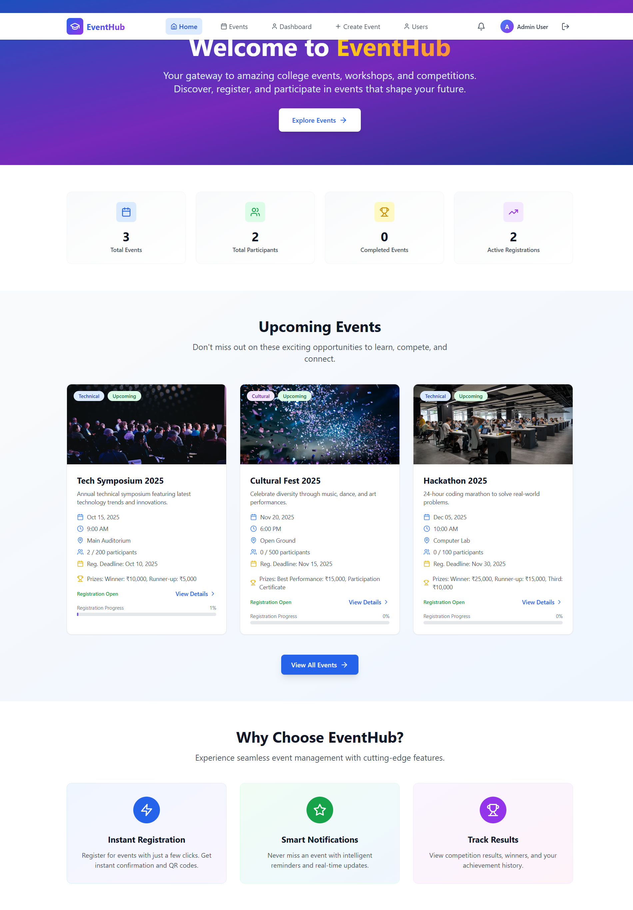
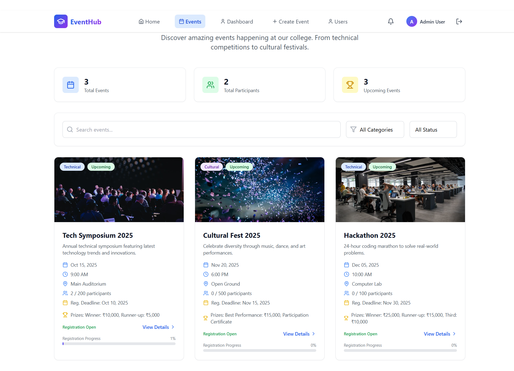
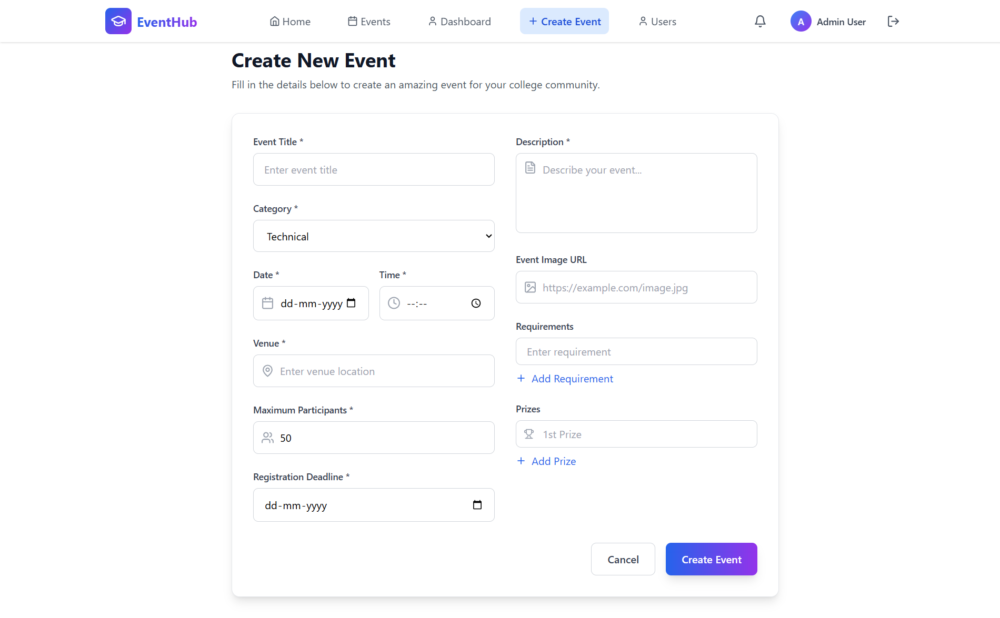
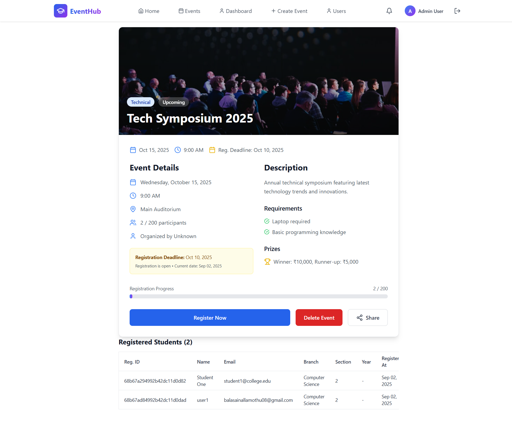
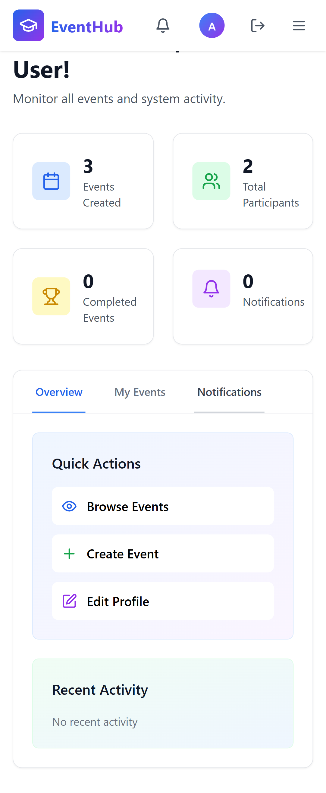

# 🎉 EventHub - College Event Management System

A modern, full-stack web application for managing college events, registrations, and user profiles. Built with React 18, TypeScript, Vite, Node.js/Express, MongoDB Atlas, and Tailwind CSS with advanced features like **unified QR code scanning**, **multi-event registration**, **real-time attendance tracking**, and **comprehensive user management**.

---

## 🚀 Overview
EventHub is a comprehensive event management system that streamlines college event organization, allowing admins and organizers to create, edit, and manage events while students can register, view details, and manage their profiles. The system features role-based authentication, unified QR scanner interface, multi-event registration capabilities, bulk operations, real-time notifications, live image previews, profile picture uploads, and demo accounts for easy testing.

### 🎯 Key Highlights
- **Modern Tech Stack:** React 18 + TypeScript + Vite for blazing-fast development
- **Robust Backend:** Node.js/Express with MongoDB Atlas and comprehensive error handling
- **Advanced QR System:** Unified camera interface with multi-event QR code support
- **QR Code Features:** Event names displayed on QR codes, secure HMAC-SHA256 signatures
- **Unified QR Scanner:** Single camera interface with clean UX design
- **Seamless Registration:** Smooth event registration system with multi-event support
- **Mobile-First Design:** Responsive UI with Tailwind CSS
- **Production Ready:** Optimized build process with comprehensive testing

---

## 🏗️ Project Architecture

```
project/
├── .gitignore                # Git ignore configuration
├── eslint.config.js          # ESLint configuration for code quality
├── index.html                # Main HTML template with favicon links
├── package.json              # Frontend dependencies and scripts
├── postcss.config.js         # PostCSS configuration for Tailwind
├── README.md                 # Project documentation
├── tailwind.config.js        # Tailwind CSS customization
├── tsconfig.app.json         # TypeScript config for application
├── tsconfig.json             # Main TypeScript configuration
├── tsconfig.node.json        # TypeScript config for Node.js tools
├── vite.config.ts            # Vite bundler configuration
├── public/                   # Static assets served by Vite
│   ├── favicon.svg           # Application favicon (EventHub logo)
│   └── screenshots/          # Project screenshots for documentation
│       ├── home.png          # Landing page screenshot
│       ├── dashboard.png     # Dashboard view screenshot
│       ├── create-event.png  # Event creation page screenshot
│       ├── event-details.png # Event details page screenshot
│       └── mobile.png        # Mobile responsive view screenshot
├── server/                   # Backend API (Node.js/Express)
│   ├── .env                  # Environment variables (MongoDB URI, JWT secret)
│   ├── index.js              # Main backend server with all routes
│   ├── package.json          # Backend dependencies and scripts
│   └── node_modules/         # Backend installed packages
└── src/                      # Frontend React application
    ├── App.tsx               # Main app component with routing
    ├── index.css             # Global styles and Tailwind imports
    ├── main.tsx              # React application entry point
    ├── vite-env.d.ts         # Vite TypeScript declarations
    ├── components/           # Reusable UI components
    │   ├── DashboardBulkDelete.tsx  # Bulk delete functionality
    │   ├── EventCard.tsx     # Event display card component
    │   ├── MultiEventRegistration.tsx # Multi-event registration with QR codes
    │   ├── QRScanner.tsx     # QR code scanner for attendance
    │   ├── Navbar.tsx        # Navigation header component
    │   ├── ProtectedRoute.tsx# Authentication route protection
    │   └── ui/
    │       └── Toast.tsx     # Toast notification system
    ├── contexts/             # React Context providers
    │   ├── AuthContext.tsx   # Authentication state management
    │   ├── EventContext.tsx  # Event data and operations
    │   ├── NotificationContext.tsx # Notification handling
    │   └── ThemeContext.tsx  # Theme management (future use)
    ├── pages/                # Application pages/views
    │   ├── AdminUsers.tsx    # User management for admins
    │   ├── CreateEvent.tsx   # Event creation and editing
    │   ├── Dashboard.tsx     # User dashboard with overview
    │   ├── EventDetails.tsx  # Detailed event view and participants
    │   ├── Events.tsx        # Events listing with multi-register toggle
    │   ├── EventsFixed.tsx   # Alternative events view
    │   ├── Home.tsx          # Landing page
    │   ├── Login.tsx         # Authentication page with demo accounts
    │   ├── Profile.tsx       # User profile management
    │   ├── QRScannerPage.tsx # QR scanner interface for organizers
    │   ├── Register.tsx      # User registration
    │   └── RegisterFixed.tsx # Alternative registration form
    └── types/
        └── index.ts          # TypeScript interfaces and types
```

### 🔧 Technical Architecture

#### Frontend (React + TypeScript + Vite)
- **Framework:** React 18 with TypeScript for type safety
- **Build Tool:** Vite for fast development and optimized builds
- **Styling:** Tailwind CSS for responsive design
- **Routing:** React Router DOM v7 for navigation
- **State Management:** React Context API with custom hooks
- **Forms:** React Hook Form with Zod validation
- **QR Codes:** QR code generation and scanning capabilities

#### Backend (Node.js + Express + MongoDB)
- **Runtime:** Node.js with ES modules
- **Framework:** Express.js for REST API
- **Database:** MongoDB Atlas (cloud database)
- **ODM:** Mongoose for data modeling
- **Authentication:** JWT tokens with bcrypt password hashing
- **File Handling:** Base64 image storage for profile pictures

---

## ✨ Advanced Features

### 🔐 Authentication & Authorization
- **Multi-role System:** Student, Organizer, Admin with specific permissions
- **JWT Authentication:** Secure token-based authentication
- **Protected Routes:** Role-based route protection
- **Demo Accounts:** Pre-configured accounts for quick testing
- **Password Security:** Bcrypt hashing for secure password storage

### 📅 Event Management
- **Complete CRUD Operations:** Create, read, update, delete events
- **Event Categories:** Technical, Cultural, Sports, Workshop, Seminar
- **Live Image Preview:** Real-time validation and preview of event images
- **Registration Management:** Track participants and registration status
- **Event Status Tracking:** Upcoming, Ongoing, Completed, Cancelled
- **Bulk Operations:** Mass delete events with admin privileges

### 👥 User Management
- **Profile Customization:** Upload profile pictures (Base64, 5MB limit)
- **Registration ID System:** Unique registration IDs for each user
- **User Roles:** Comprehensive role-based access control
- **Admin User Management:** View and manage all users (AdminUsers page)
- **Department & Branch Tracking:** Organize users by academic details

### 🎯 Registration System
- **Multi-Event Registration:** Register for multiple events in one session
- **Unique QR Codes:** Each event generates its own QR code with event name overlay
- **QR Code Features:** Event names displayed below QR codes with custom canvas rendering
- **Secure QR Codes:** HMAC-SHA256 signatures prevent tampering and forgery
- **QR Code Specifications:** 300x300px PNG with Arial 16px bold event names
- **Download QR Codes:** One-click download of individual event QR codes
- **QR Scanner:** Built-in camera scanner for organizers and admins
- **Attendance Tracking:** Real-time attendance marking with scan validation
- **Scan History:** Complete log of all QR code scans with timestamps
- **Registration Limits:** Maximum participant controls with validation
- **Registration Deadlines:** Time-bound registration periods

### 📱 Advanced QR Code System
- **Event-Specific QR Codes:** Each registration generates a unique QR code per event
- **Visual Event Identification:** Event names prominently displayed on QR images
- **Canvas-Based Generation:** Custom QR generation with HTML5 Canvas and text overlays
- **Unified QR Scanner Interface:**
  - Clean, single camera window design
  - Camera-based scanning with HTML5 QR code reader
  - Manual entry fallback option
  - Real-time validation and feedback
  - Scan statistics and history tracking
- **Security Features:**
  - HMAC-SHA256 cryptographic signatures
  - Timestamp validation and expiry
  - Event-specific validation prevents cross-event usage
- **Multi-Event Support:**
  - Register for multiple events simultaneously
  - Each event gets its own downloadable QR code
  - Bulk registration with individual QR generation
- **Organizer Tools:**
  - QR Scanner page accessible to organizers and admins
  - Event selection dropdown for targeted scanning
  - Success/failure tracking with detailed reports
- **Reliable Registration System:**
  - Smooth event registration process
  - Proper database integration
  - Comprehensive error handling and validation

### 🔔 Notification System
- **Toast Notifications:** Real-time feedback for user actions
- **Error Handling:** Comprehensive error messages and validation
- **Success Confirmations:** Clear feedback for completed actions
- **Context-aware Notifications:** Relevant notifications based on user role

### 🎨 User Interface
- **Responsive Design:** Mobile-first approach with Tailwind CSS
- **Modern UI Components:** Clean, professional interface
- **Interactive Elements:** Hover effects, smooth transitions
- **Accessibility:** WCAG compliant design principles
- **Dark Mode Ready:** Theme context prepared for future implementation

---

## 🛠️ Installation & Setup Guide

### 📋 Prerequisites
Ensure you have the following installed on your system:
- **Node.js** (v18.0.0 or higher) - [Download here](https://nodejs.org/)
- **npm** (v9.0.0 or higher) - Comes with Node.js
- **Git** - [Download here](https://git-scm.com/)
- **MongoDB Atlas Account** - [Sign up here](https://www.mongodb.com/atlas)
- **Code Editor** - VS Code recommended

### 🚀 Step-by-Step Installation

#### 1. Clone the Repository
```bash
# Clone the project
git clone https://github.com/your-username/college-event-management.git

# Navigate to project directory
cd project
```

#### 2. Frontend Setup
```bash
# Install frontend dependencies
npm install

# Verify installation
npm list --depth=0
```

#### 3. Backend Setup
```bash
# Navigate to server directory
cd server

# Install backend dependencies
npm install

# Verify backend installation
npm list --depth=0

# Return to project root
cd ..
```

#### 4. Database Configuration

**Step 4.1: Create MongoDB Atlas Cluster**
1. Go to [MongoDB Atlas](https://www.mongodb.com/atlas)
2. Sign up/Login to your account
3. Create a new cluster (choose free tier)
4. Wait for cluster deployment (2-3 minutes)

**Step 4.2: Configure Database Access**
1. Click "Database Access" in the left sidebar
2. Add a new database user:
   - Username: `admin`
   - Password: Generate secure password
   - Built-in Role: `Atlas admin`
3. Click "Network Access" in the left sidebar
4. Add IP Address: `0.0.0.0/0` (Allow access from anywhere)

**Step 4.3: Get Connection String**
1. Go to "Databases" and click "Connect"
2. Choose "Connect your application"
3. Select "Node.js" driver
4. Copy the connection string

#### 5. Environment Variables Setup
```bash
# Navigate to server directory
cd server

# Create environment file (Windows)
echo. > .env

# Open .env file and add the following:
```

**Add to `.env` file:**
```env
# Database Configuration
MONGODB_URI=mongodb+srv://admin:<password>@cluster0.xxxxx.mongodb.net/college_events?retryWrites=true&w=majority

# JWT Secret (generate a random 64-character string)
JWT_SECRET=your_super_secret_jwt_key_here_make_it_long_and_random

# Server Configuration
PORT=5000

# Optional: QR Code Configuration
QR_CODE_SECRET=your_qr_code_secret_key
```

**Important Notes:**
- Replace `<password>` with your actual database password
- Replace `xxxxx` with your actual cluster identifier
- Generate a strong JWT secret (you can use online generators)

#### 6. Verify Installation
```bash
# Check Node.js version
node --version

# Check npm version
npm --version

# Test backend dependencies
cd server
npm test

# Return to project root
cd ..

# Test frontend dependencies
npm run lint
```

---

## 🚀 Running the Application

### Method 1: Concurrent Development (Recommended)
```bash
# From project root directory
npm run dev
```
This command runs both frontend and backend simultaneously using `npm-run-all`.

### Method 2: Separate Terminal Windows

**Terminal 1 - Backend Server:**
```bash
# Navigate to server directory
cd server

# Start backend server
npm start

# Server will run on: http://localhost:5000
```

**Terminal 2 - Frontend Development Server:**
```bash
# From project root (new terminal)
npm run frontend

# Frontend will run on: http://localhost:5173
```

### Method 3: Individual Commands
```bash
# Backend only
npm run start-server

# Frontend only
npm run frontend

# Build for production
npm run build

# Preview production build
npm run preview
```

### 🌐 Accessing the Application

| Service | URL | Description |
|---------|-----|-------------|
| **Frontend** | http://localhost:5173 | Main application interface |
| **Backend API** | http://localhost:5000 | REST API endpoints |
| **API Health Check** | http://localhost:5000/api/health | Server status |

### 📱 Demo Accounts

The application comes with pre-configured demo accounts for testing:

| Role | Email | Password | Description |
|------|-------|----------|-------------|
| **Admin** | admin@college.edu | admin123 | Full system access |
| **Organizer** | organizer@college.edu | org123 | Event management |
| **Student** | student@college.edu | student123 | Event registration |

### 🔧 Development Scripts

```bash
# Linting and code quality
npm run lint              # Check code quality

# Building
npm run build             # Production build
npm run preview           # Preview production build

# Development
npm run dev               # Development with hot reload
npm run frontend          # Frontend only
npm run backend           # Backend only
```

### 🐛 Troubleshooting

**Common Issues and Solutions:**

1. **Port Already in Use**
   ```bash
   # Kill process on port 5000 (Windows PowerShell)
   netstat -ano | findstr :5000
   taskkill /PID <process_id> /F
   
   # Change port in server/index.js if needed
   ```

2. **MongoDB Connection Issues**
   - Verify MongoDB Atlas connection string
   - Check network access settings (whitelist IP: 0.0.0.0/0)
   - Ensure correct username/password in .env file

3. **Frontend Build Issues**
   ```bash
   # Clear node_modules and reinstall
   Remove-Item -Recurse -Force node_modules, package-lock.json
   npm install
   ```

4. **Backend Dependencies Issues**
   ```bash
   cd server
   Remove-Item -Recurse -Force node_modules, package-lock.json
   npm install
   ```

### 📊 Environment Verification

**Check if everything is working:**
```bash
# Test backend API (use curl or browser)
curl http://localhost:5000/api/health

# Check frontend build
npm run build
```

---

## 🧑‍💻 Usage Guide & Features

### 🚪 Getting Started
1. **Access the Application:** Navigate to http://localhost:5173
2. **Choose Authentication Method:**
   - Use demo accounts (see table above) for quick testing
   - Create a new account via the registration page

### 📋 Basic Workflow
1. **Browse Events:** Students view available events with filters
2. **Register:** Click register button on EventCard or EventDetails
3. **Get QR Code:** Automatic QR code generation for event access
4. **Track Status:** View registration status in Dashboard

#### Core Features
- **QR Code Generation:** Automatic QR codes for event registrations
- **QR Code Scanning:** Built-in scanner for event check-ins
- **Registration Tracking:** Monitor attendance and participation
- **Registration Limits:** Maximum participant controls

### 👤 User Roles & Capabilities

#### 🎓 Student Features
- **Event Discovery:** Browse and filter events by category
- **Multi-Event Registration:** Register for multiple events simultaneously
- **Profile Management:** Upload profile picture, view registration ID
- **Dashboard:** View registered events and participation history
- **QR Code Access:** Get unique QR codes for each registered event with event names
- **Download QR Codes:** Download individual QR codes for offline use

#### 👨‍🏫 Organizer Features
- **Event Creation:** Create and manage events
- **Event Editing:** Modify event details, requirements, and settings
- **Participant Management:** View registered participants
- **Event Status Control:** Update event status (upcoming, ongoing, completed)
- **QR Scanner Access:** Use QR scanner to validate event attendance
- **Attendance Tracking:** Mark attendance and view scan history
- **Event-Specific Scanning:** Only scan QR codes for events they organize

#### 🔧 Admin Features
- **Full Event Management:** Create, edit, delete any event
- **User Management:** View and manage all users via AdminUsers page
- **Bulk Operations:** Mass delete events using DashboardBulkDelete
- **System Overview:** Complete system administration capabilities
- **Universal QR Scanner:** Scan QR codes for all events in the system
- **Advanced Analytics:** View comprehensive scan statistics and reports

### 🎯 Key Features In Action

#### Event Management Workflow
1. **Create Event:** (Admin/Organizer) Use CreateEvent page with live image preview
2. **Set Details:** Add description, venue, date, participant limits
3. **Publish:** Event appears in Events listing with filtering options
4. **Monitor:** Track registrations in EventDetails page

#### Registration Process
1. **Browse Events:** Students view available events with filters
2. **Choose Registration Method:**
   - **Single Event:** Click register on individual EventCard or EventDetails
   - **Multi-Event:** Use "Multi-Register" toggle on Events page for bulk registration
3. **Multi-Event Selection:** Select multiple events from grid layout
4. **Get QR Codes:** Each event generates unique QR code with event name displayed
5. **Download & Save:** Download individual QR codes for each registered event
6. **Track Status:** View registration status and QR codes in Dashboard

#### QR Code Attendance Process
1. **Event Day:** Students bring QR codes (physical or digital)
2. **Organizer Scanner:** Organizers access QR Scanner page from navigation
3. **Select Event:** Choose specific event to scan for from dropdown
4. **Scan QR Code:** Use camera scanner or manual entry for validation
5. **Instant Validation:** Real-time verification with event name confirmation
6. **Attendance Marked:** Successful scans logged with timestamps and user details

#### Profile Customization
1. **Access Profile:** Navigate to Profile page
2. **Upload Picture:** Drag & drop or select image (5MB limit)
3. **Update Info:** Modify personal details and academic information
4. **View Reg ID:** Access unique registration identifier

### 🔄 API Endpoints

| Method | Endpoint | Description | Access |
|--------|----------|-------------|---------|
| POST | `/api/auth/login` | User authentication | Public |
| POST | `/api/auth/register` | User registration | Public |
| GET | `/api/events` | Fetch all events | Authenticated |
| POST | `/api/events` | Create new event | Admin/Organizer |
| PUT | `/api/events/:id` | Update event | Admin/Organizer |
| DELETE | `/api/events/:id` | Delete event | Admin/Organizer |
| POST | `/api/events/:id/register` | Register for single event | Student |
| POST | `/api/events/register-multiple` | Multi-event registration | Student |
| POST | `/api/qr/validate` | Validate QR code and mark attendance | Organizer/Admin |
| GET | `/api/users/profile` | Get user profile | Authenticated |
| PUT | `/api/users/profile` | Update profile | Authenticated |

---

## 📦 Technology Stack

### Frontend Technologies
| Technology | Version | Purpose |
|------------|---------|---------|
| **React** | ^18.3.1 | UI Framework |
| **TypeScript** | ^5.5.3 | Type Safety |
| **Vite** | ^7.1.3 | Build Tool & Dev Server |
| **Tailwind CSS** | ^3.4.1 | Styling Framework |
| **React Router DOM** | ^7.8.2 | Navigation & Routing |
| **React Hook Form** | ^7.62.0 | Form Management |
| **Zod** | ^4.1.5 | Schema Validation |
| **Lucide React** | ^0.344.0 | Icon Library |
| **QRCode.react** | ^4.2.0 | QR Code Generation |
| **html5-qrcode** | ^2.3.8 | QR Code Scanning |
| **date-fns** | ^4.1.0 | Date Utilities |

### Backend Technologies
| Technology | Version | Purpose |
|------------|---------|---------|
| **Node.js** | Latest | Runtime Environment |
| **Express.js** | ^4.18.2 | Web Framework |
| **MongoDB** | ^6.19.0 | Database Driver |
| **Mongoose** | ^7.6.0 | ODM for MongoDB |
| **bcryptjs** | ^3.0.2 | Password Hashing |
| **QRCode** | ^1.5.4 | Server-side QR Generation |
| **qr-image** | ^1.2.0 | QR Image Generation |
| **Canvas** | ^2.11.2 | HTML5 Canvas for QR overlays |
| **CORS** | ^2.8.5 | Cross-Origin Requests |
| **dotenv** | ^16.6.1 | Environment Variables |

### Development Tools
- **ESLint** - Code linting and quality
- **PostCSS** - CSS processing
- **npm-run-all** - Concurrent script execution
- **TypeScript ESLint** - TypeScript linting rules

---

## 🔒 Security Features

### Authentication Security
- **JWT Tokens:** Secure, stateless authentication
- **Password Hashing:** bcrypt with salt rounds
- **Role-based Access:** Granular permission system
- **Protected Routes:** Frontend and backend route protection

### Data Security
- **Input Validation:** Zod schema validation
- **XSS Protection:** React's built-in XSS prevention
- **CORS Configuration:** Controlled cross-origin requests
- **Environment Variables:** Sensitive data protection

### File Upload Security
- **Base64 Encoding:** Secure image storage
- **File Size Limits:** 5MB maximum for profile pictures
- **Type Validation:** Image format verification

---

## 🚀 Deployment Guide

### Prerequisites for Deployment
- **MongoDB Atlas:** Production database
- **Node.js hosting:** Heroku, Vercel, Railway, etc.
- **Static hosting:** Netlify, Vercel for frontend

### Build for Production
```bash
# Build frontend
npm run build

# The dist/ folder contains production files
```

### Environment Variables for Production
```env
NODE_ENV=production
MONGODB_URI=your_production_mongodb_uri
JWT_SECRET=your_production_jwt_secret
FRONTEND_URL=https://your-frontend-domain.com
PORT=5000
```

### Deployment Steps
1. **Deploy Backend:** Upload server/ folder to your hosting service
2. **Deploy Frontend:** Upload dist/ folder to static hosting
3. **Configure Environment:** Set production environment variables
4. **Update CORS:** Configure CORS for your production domain

---

## 🤝 Contributing

We welcome contributions to improve the College Event Management System! Here's how you can contribute:

### 🛠️ Development Setup for Contributors
1. Fork the repository
2. Clone your fork: `git clone https://github.com/your-username/college-event-management.git`
3. Create a feature branch: `git checkout -b feature/your-feature-name`
4. Follow the installation guide above
5. Make your changes and test thoroughly
6. Submit a pull request

### 📝 Contribution Guidelines
- **Code Style:** Follow the existing TypeScript and React patterns
- **Commits:** Use clear, descriptive commit messages
- **Testing:** Test your changes on both frontend and backend
- **Documentation:** Update README if adding new features
- **Issues:** Open an issue before major changes

### 🐛 Bug Reports
- Use the GitHub issue tracker
- Include steps to reproduce
- Provide system information (OS, Node.js version, etc.)
- Include screenshots if applicable

---

## 📄 License

This project is licensed under the MIT License - see the [LICENSE](LICENSE) file for details.

### MIT License Summary
- ✅ Commercial use
- ✅ Modification
- ✅ Distribution
- ✅ Private use
- ❌ Liability
- ❌ Warranty

---

## 🙏 Credits & Acknowledgments

### 👨‍💻 Development Team

#### **Core Contributors**
-**[Mokshyagna yadav](https://github.com/Sensui-moksha)**

- **[Bhavya Sree](https://github.com/bhavyasree1076)**

- **[Naseem](https://github.com/NaseemShaik-Mic)**

- **[Deekshitha](https://github.com/deekshithapavuluri17)**

- **[Malinsheema](https://github.com/malin999sheema)**

### 🤝 **Team Collaboration**
This project was built through collaborative effort using modern development practices:
- **Version Control:** Git/GitHub for code collaboration
- **Code Reviews:** Peer review process for quality assurance
- **Agile Development:** Sprint-based development with regular standups
- **Knowledge Sharing:** Cross-training and pair programming sessions

### 📚 Libraries & Resources
- [React Team](https://react.dev/) for the amazing React framework
- [Tailwind CSS](https://tailwindcss.com/) for the utility-first CSS framework
- [MongoDB](https://www.mongodb.com/) for the database solution
- [Lucide](https://lucide.dev/) for the beautiful icon set
- [Vite](https://vitejs.dev/) for the lightning-fast build tool

### 🎨 Design Inspiration
- Modern college management systems
- Material Design principles
- Accessibility-first approach

---

## 📷 Screenshots & Demo

### 🖼️ Application Screenshots

#### Landing Page

*Clean, modern landing page with clear navigation*

#### Event Dashboard

*Comprehensive dashboard showing user events and registrations*

#### Event Creation

*Intuitive event creation with live image preview*

#### Event Details

*Detailed event view with participant management*

#### Mobile Responsive

*Fully responsive design for all devices*

---

## ❓ Frequently Asked Questions

### General Questions

**Q: Can I use this for my college or organization?**
A: Absolutely! This project is open-source under MIT license. Fork it, customize it, and deploy it for your needs.

**Q: Do I need to pay for MongoDB?**
A: MongoDB Atlas offers a free tier (512MB) which is sufficient for development and small deployments.

**Q: Can I add more user roles?**
A: Yes! Update the `User` interface in `src/types/index.ts` and modify the authentication logic accordingly.

### Technical Questions

**Q: How do I add new event categories?**
A: Update the `Event` interface in `src/types/index.ts` and modify the CreateEvent form dropdown.

**Q: Where are profile pictures stored?**
A: Profile pictures are stored as base64 strings in MongoDB. For production, consider using cloud storage like AWS S3.

**Q: How do I customize the UI theme?**
A: Modify `tailwind.config.js` for colors and styles. The ThemeContext is prepared for dark mode implementation.

**Q: Can I integrate with external authentication (Google, GitHub)?**
A: Yes! You can extend the AuthContext and add OAuth providers. Consider using libraries like `passport.js`.

### Deployment Questions

**Q: Where can I deploy this application?**
A: 
- **Frontend:** Netlify, Vercel, GitHub Pages
- **Backend:** Heroku, Railway, DigitalOcean, AWS
- **Database:** MongoDB Atlas (recommended)

**Q: How do I handle environment variables in production?**
A: Use your hosting platform's environment variable settings. Never commit `.env` files to version control.

---

## 🔗 Useful Links & Resources

### 📖 Documentation
- [React 18 Documentation](https://react.dev/)
- [TypeScript Handbook](https://www.typescriptlang.org/docs/)
- [Vite Guide](https://vitejs.dev/guide/)
- [Tailwind CSS Docs](https://tailwindcss.com/docs)
- [Express.js Guide](https://expressjs.com/en/guide/routing.html)
- [MongoDB Atlas Tutorial](https://docs.atlas.mongodb.com/getting-started/)

### 🛠️ Tools & Extensions
- [VS Code](https://code.visualstudio.com/) - Recommended IDE
- [React Developer Tools](https://react.dev/learn/react-developer-tools)
- [MongoDB Compass](https://www.mongodb.com/products/compass) - Database GUI
- [Postman](https://www.postman.com/) - API testing

---

## 📊 Project Statistics

- **Lines of Code:** ~15,000+
- **Components:** 15+ React components
- **API Endpoints:** 20+ REST endpoints
- **Supported Browsers:** Brave , Chrome, Firefox, Safari, Edge etc.....
- **Mobile Support:** iOS Safari, Chrome Mobile
- **Database Collections:** Users, Events, Registrations

---

## 🚀 Future Enhancements

### Completed Features ✅
- [x] **QR Code System** - Secure QR generation and scanning
- [x] **Multi-Event Registration** - Register for multiple events at once
- [x] **Event Name on QR Codes** - Custom QR codes with event names
- [x] **Role-based Scanner Access** - Organizers and admins can scan QR codes
- [x] **Attendance Tracking** - Real-time attendance verification
- [x] **Clean QR Scanner Interface** - Unified camera interface
- [x] **Robust Registration System** - Reliable event registration

### Planned Features
- [ ] **Real-time Notifications** - WebSocket integration
- [ ] **Email Notifications** - Automated email system
- [ ] **Advanced Analytics** - Event analytics dashboard with QR scan metrics
- [ ] **Calendar Integration** - Google Calendar sync
- [ ] **Payment Integration** - Paid event support
- [ ] **Dark Mode** - Complete theme system
- [ ] **Multi-language Support** - Internationalization
- [ ] **Mobile App** - React Native version with native QR scanning
- [ ] **Advanced Search** - Elasticsearch integration
- [ ] **File Upload** - Cloud storage for documents
- [ ] **Bulk QR Operations** - Export multiple QR codes
- [ ] **Offline QR Scanning** - Sync when connection restored
#
